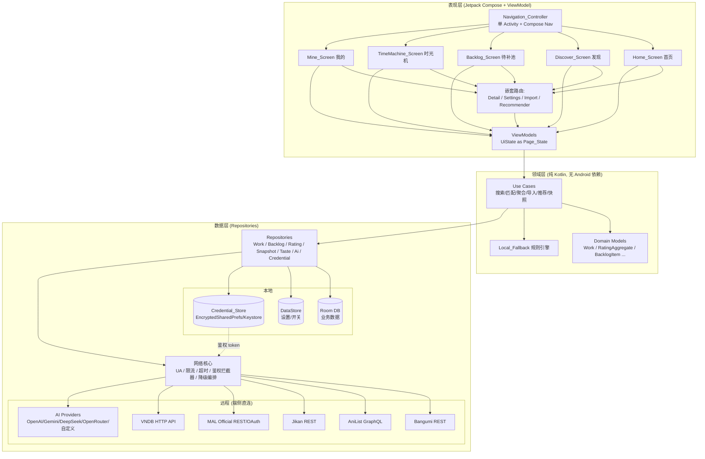
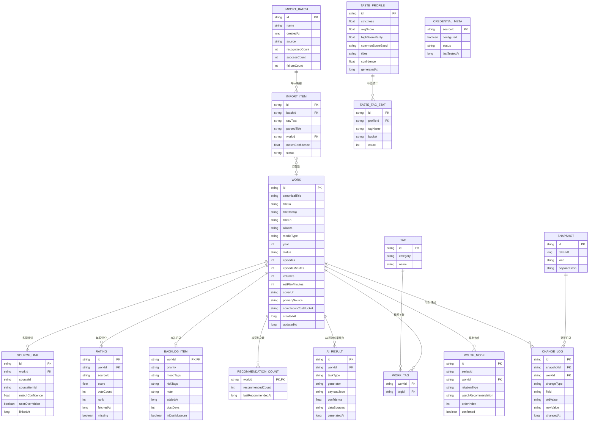
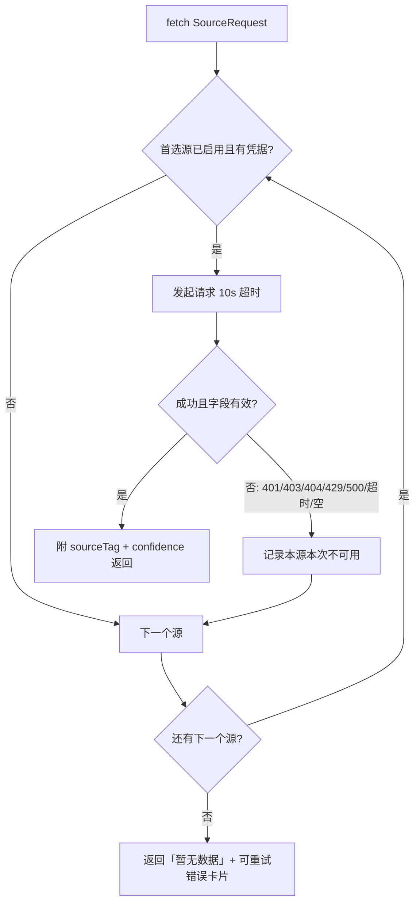
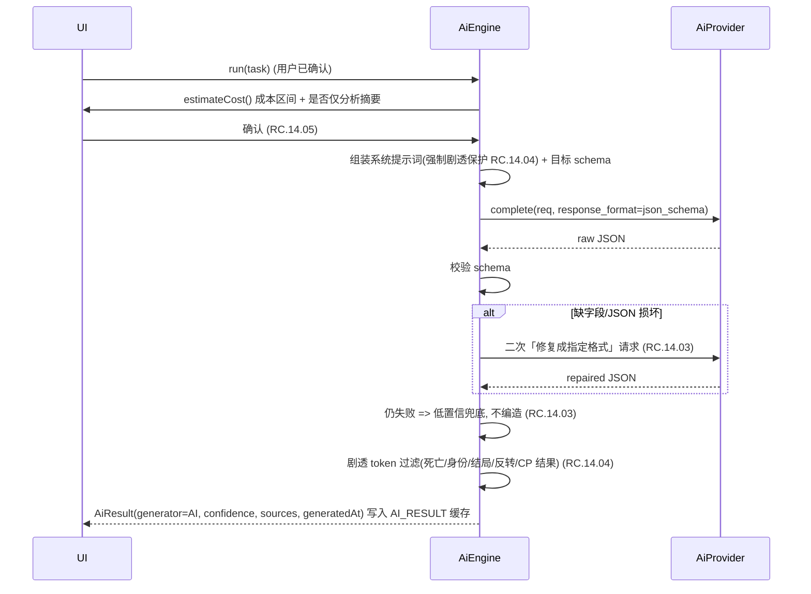
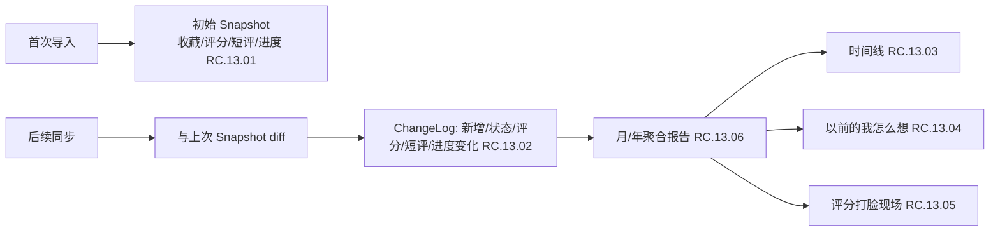

# 设计文档：ACG Compass

## Overview

ACG Compass 是一个**本地优先（local-first）、无后端、隐私安全**的原生 Android 应用，作为多平台 ACG（动画 / 漫画 / 游戏 / Visual Novel）的「个人决策层」。它不提供播放、下载、漫画源聚合或盗版资源搜索（RC.00），而是在 Bangumi、AniList、MAL/Jikan、VNDB 等公开数据源之上，提供批量导入、多源评分聚合、个人评分/短评记录、无剧透评价摘要、口味画像与「今晚看什么」推荐。

### 设计目标（映射产品定位）

| 目标 | 设计落点 | 关联需求 |
| --- | --- | --- |
| 本地优先、无后端 | 所有业务数据落地 Room；同步/聚合/AI 调用均在端侧由用户配置的第三方 API 直连完成 | RC.00 (1.1)、RC.16 |
| 隐私与安全 | 凭据仅存于 EncryptedSharedPreferences/Keystore；代码与导出默认零密钥；日志脱敏 | RC.00 (1.2/1.5/1.7)、RC.02 |
| 不伪造内容 | 缺失字段显示「暂无数据」；多源降级标注来源与置信度；AI 低置信不编造 | RC.01 (3.7/3.8)、RC.07 (9.3)、RC.14 (16.4) |
| 升级不丢数据 | Room 渐进式迁移 + 备份兜底；导入合并不覆盖 | RC.00 (1.8)、RC.16 (18.3/18.5) |
| 现代原生体验 | Jetpack Compose + Material 3、深色模式、动态取色、统一 Page_State | RC.03 (5.8) |
| 无广告、低成本 | 端侧直连，无自有服务器成本；AI 调用前展示成本估算与确认 | 产品定位、RC.14 (16.6) |

### 技术选型与理由

- **语言：Kotlin**。Android 一等公民，协程/Flow 原生支持。
- **UI：Jetpack Compose + Material 3**。声明式 UI、动态取色与深色模式开箱即用，统一卡片与状态组件成本低（RC.03.05）。
- **架构：MVVM + 分层（presentation / domain / data）**。单 Activity + Compose Navigation，便于 5 栏底栏与嵌套路由（RC.03.02）。
- **本地持久化：Room**（业务数据）+ **DataStore（Preferences）**（设置/开关）+ **EncryptedSharedPreferences/Keystore**（凭据）。职责分离，凭据加密隔离（RC.00、RC.02）。
- **网络：Retrofit + OkHttp + kotlinx.serialization**（REST：Bangumi/Jikan/MAL/VNDB）；**Apollo GraphQL**（AniList）。集中式拦截器统一 User-Agent、限流、超时与鉴权注入（RC.01）。
- **AI：Provider 抽象（`AiProvider` 接口）**，支持 OpenAI / Gemini / DeepSeek / OpenRouter / 自定义 OpenAI 兼容；结构化输出 + schema 修复二次请求；无 key 时本地规则回退（RC.14、RC.09.03）。
- **异步：Coroutines + Flow；DI：Hilt；图片：Coil；后台同步：WorkManager**。
- **构建：Gradle Kotlin DSL，minSdk 26，targetSdk 当前最新**。覆盖绝大多数现役设备，支持现代 API。

> 实现前置约束（RC.01）：在实现任一 `Data_Source` 接入前，开发流程 **必须** 联网核验该源最新官方文档（授权方式、字段、速率限制、返回结构）并将链接与核验日期写入 `DEVELOPMENT.md`。本设计中的速率/字段为基于既有文档的设计假设，以核验结果为准。所有凭据均由用户自行提供，代码与资源中不包含任何 key/token/secret。

## Architecture

### 分层架构

采用 MVVM + Clean-ish 三层。依赖方向自上而下单向：UI → Domain → Data，Domain 不依赖 Android framework，便于单元/属性测试。



### 关键架构决策

1. **单一可信源（Single Source of Truth）= Room**。远程数据拉取后写入 Room 缓存，UI 始终从 Room 的 Flow 读取，离线可用、状态一致（RC.00 本地优先）。
2. **降级编排集中在 `DataSourceOrchestrator`**（数据层），按 `Bangumi(P0) → AniList(P1) → Jikan(P1/P2) → MAL_Official(P2) → VNDB(P2)` 顺序回退，结果带 `sourceTag` 与 `matchConfidence`（RC.01 3.8）。
3. **UiState 即 Page_State**。每个 ViewModel 暴露 `StateFlow<UiState<T>>`，`UiState` 是封闭类，七种状态一一对应（RC.03.07）。
4. **凭据物理隔离**。凭据永不进入 Room/备份/日志；仅 `Credential_Store` 持有密文，元数据（是否配置、最后测试时间）可入 Room 用于状态展示（RC.00、RC.02）。

## Components and Interfaces

### 模块/包结构

```
com.acgcompass
├── app/                      # Application、Hilt 入口、Navigation 宿主 Activity
├── core/
│   ├── designsystem/         # Material3 主题、动态取色、深色模式、统一组件 (WorkCard, StateScaffold, ErrorCard, AiCard)
│   ├── ui/                   # UiState 封闭类、Page_State 渲染脚手架
│   ├── common/               # Result/AppError 类型、协程调度器、扩展
│   └── network/              # OkHttp/Retrofit/Apollo 工厂、拦截器(UA/限流/超时/鉴权)、RateLimiter、Orchestrator
├── data/
│   ├── local/                # Room: entities, DAOs, database, migrations, converters
│   ├── datastore/            # 设置/开关 (Preferences DataStore)
│   ├── credential/           # Credential_Store (EncryptedSharedPreferences)
│   ├── remote/
│   │   ├── bangumi/ anilist/ jikan/ mal/ vndb/   # 各源 API service + DTO + mapper
│   │   └── ai/               # AiProvider 抽象 + 各 provider 实现 + prompt/schema
│   └── repository/           # Repository 实现
├── domain/
│   ├── model/                # 领域模型 (Work, RatingAggregate, BacklogItem, ...)
│   ├── repository/           # Repository 接口
│   ├── usecase/              # 用例 (搜索/聚合/导入解析/推荐/快照 diff/口味分析)
│   └── fallback/             # Local_Fallback 规则引擎
└── feature/
    ├── home/ discover/ backlog/ timemachine/ mine/   # 5 栏
    └── detail/ settings/ import/ recommender/        # 嵌套路由
```

### 核心接口（领域层 Repository 契约）

```kotlin
interface WorkRepository {
    fun observeWork(workId: String): Flow<UiState<Work>>
    suspend fun search(query: String): Result<List<WorkMatch>>      // 多源合并 + 置信度
    suspend fun aggregateRatings(workId: String): Result<RatingAggregate>
    suspend fun overrideMatch(localId: String, chosen: SourceRef)   // 手动纠正 RC.05.03
}

interface BacklogRepository {
    fun observeBacklog(filter: BacklogFilter, sort: BacklogSort): Flow<List<BacklogItem>>
    suspend fun addAll(items: List<Work>): AddResult                // 去重 RC.06.07
    suspend fun setPriority(id: String, p: Priority)
    suspend fun bulk(op: BulkOp, ids: List<String>)                 // RC.08.05
    suspend fun draw(criteria: DrawCriteria): DrawResult            // 抽番带理由 RC.08.06
}

interface CredentialStore {                                         // 仅本地密文
    suspend fun put(source: SourceId, secret: SecretBundle)
    suspend fun get(source: SourceId): SecretBundle?
    suspend fun clear(source: SourceId)
    fun observeStatus(): Flow<Map<SourceId, CredentialStatus>>      // 仅元数据，无明文
    suspend fun exportRedacted(): RedactedCredentials               // 脱敏导出 RC.00 1.6
}

interface AiEngine {
    suspend fun <T> run(task: AiTask<T>, opts: AiRunOptions): AiResult<T>  // 结构化 + schema 修复 + 剧透保护
    fun estimateCost(task: AiTask<*>): CostRange                          // RC.14.05
}

interface DataSourceOrchestrator {
    suspend fun <T> fetch(request: SourceRequest<T>): SourceOutcome<T>     // 降级 + 来源标签 + 置信度
}
```

### 网络核心拦截器链（RC.01）

`OkHttpClient` 拦截器顺序：`UserAgentInterceptor`（注入「ACGCompass/{version}」等合规 UA，RC.01 3.2）→ `AuthInterceptor`（从 `Credential_Store` 注入对应源的鉴权头/查询参数，无凭据则透传）→ `RateLimitInterceptor`（每源独立令牌桶，达到限制 80% 即节流，RC.01 3.4/3.10）→ `TimeoutInterceptor`（10s 调用超时，RC.01 3.9）。`AiProvider` 走独立的 OkHttp 实例（不同超时/重试策略）。

## Data Models

### 领域模型与 Room 实体设计原则

- **领域模型**（`domain/model`）是纯 Kotlin，UI/用例操作的对象。
- **Room 实体**（`data/local/entity`）含持久化注解，经 mapper 与领域模型互转。
- 多源数据：一个 `WorkEntity` 为本地规范化作品，多个 `SourceLinkEntity` 关联到各源 id；评分以 `RatingEntity`（每源一行）存储后聚合为 `RatingAggregate`。
- **凭据不入 Room**：仅 `CredentialMetaEntity` 记录「是否配置、最后测试时间、状态」等非敏感元数据用于 UI（RC.02 / RC.15.01）。

### ER 图



### 关键领域模型（节选）

```kotlin
data class Work(
    val id: String,
    val titles: Titles,                 // canonical / ja / romaji / en / aliases
    val mediaType: MediaType,           // ANIME, MANGA, NOVEL, GAME, VN
    val year: Int?,
    val status: ReleaseStatus,
    val units: Units,                   // episodes, episodeMinutes, volumes, estPlayMinutes
    val coverUrl: String?,
    val primarySource: SourceId,
    val completionCost: CompletionCost, // TONIGHT, WEEKEND, LONG_HAUL  (RC.07.07)
    val tags: List<Tag>,
)

data class RatingAggregate(
    val perSource: Map<SourceId, RatingEntry?>,  // null/missing => UI 显示「暂无数据」
    val consensus: Consensus?,                   // 稳定度/争议度/优先级；不足以判定时为 null
)

data class RatingEntry(val score: Float, val voteCount: Int, val rank: Int?)

enum class Priority { HIGH, MEDIUM, LOW }

// Tag 分类法 (PRD 第 9 节)
enum class TagCategory { CONTENT_TYPE, STATUS, LENGTH, MOOD, RISK }
data class Tag(val category: TagCategory, val name: String)
```

### 多源标识与匹配模型（RC.05.02/03）

- **规范化作品（canonical Work）** 是本地主键；每个外部源通过 `SOURCE_LINK(sourceId, sourceItemId, matchConfidence)` 关联。
- **匹配流程**：搜索时对各源结果做标题归一化（中/日/罗马音/英/别名，去符号、全半角、大小写）→ 计算相似度（标题相似度 + 年份/类型一致性）→ 产出 `matchConfidence ∈ [0,1]`。
- **合并规则**：高于阈值（如 0.85）自动合并为同一 `Work`；低于阈值标记低置信，要求用户在导入/搜索时手动确认（RC.05.03 / RC.06.08）。
- **手动纠正**：`overrideMatch` 写入 `userOverridden=true`，后续同步不再自动改写该链接。
- **被安利次数**：`RECOMMENDATION_COUNT.recommendedCount` 在每次导入命中同一 `Work` 时自增（RC.06.06）。

## 数据源接入设计（RC.01 / RC.02）

> **实现前置（强制）**：每个源接入实现前必须联网核验最新官方文档并把「文档链接 + 核验日期 + 实际字段 + 速率限制 + 失败处理」记入 `DEVELOPMENT.md`（RC.01 3.1/3.6）。下表为设计假设，最终以核验为准。所有凭据均由用户在设置页自行填写，**代码、资源、测试、README、日志中不得出现任何 key/token/secret**（RC.00 1.2）。

### 各源客户端职责与鉴权模型

| 源 | 优先级 | 鉴权（用户提供） | 主要数据 | 速率/约束（待核验） | 协议 |
| --- | --- | --- | --- | --- | --- |
| Bangumi | P0 | Access Token / OAuth | 中文条目、评分、排名、标签、收藏、个人评分/短评、进度、关联、角色 | 合规 User-Agent（含应用名+版本）必填 | REST + kotlinx.serialization |
| AniList | P1 | 可选 Token（公共查询免鉴权） | 国际评分、热度、趋势、Reviews、用户列表、罗马音/英文、Staff、本季 | GraphQL 速率限制 | Apollo GraphQL |
| Jikan | P1/P2 | 无 key | MAL 评分、排名、人气、Reviews、Recommendations | 约 3 req/s & 60 req/min | REST |
| MAL Official | P2 | Client ID(+可选 Secret)，OAuth/PKCE | 官方用户列表、进度、评分 | 仅用户显式配置后启用 | REST + OAuth2 PKCE |
| VNDB | P2 | 可选 Token | VN 资料、评分、标签、角色、Staff、制作社、用户 VN 列表 | 成人内容分级过滤 | HTTP API (POST/JSON) |

### 集中式降级编排

`DataSourceOrchestrator` 按需求顺序回退：`Bangumi → AniList → Jikan → MAL_Official → VNDB`（RC.01 3.8）。



- **字段级降级**：单条目某字段缺失时，仅该字段位置显示「暂无数据」，不影响其余字段（RC.01 3.7 / RC.07 9.3）。
- **来源标签与置信度**：UI 在数据旁显示当前来源标签与 `Match_Confidence`（RC.01 3.8 / RC.05.02）。
- **中文资料兜底**：Bangumi 不可用时使用 AniList/Jikan 英文资料，并允许用户手动修正标题（RC.01 3.11）。
- **限流**：每源独立令牌桶（如 Jikan 配置 3 req/s 且 60 req/min 双桶）；达到 80% 即主动节流（RC.01 3.10）。
- **不抓网页**：无稳定官方接口的能力（如完整历史）一律降级，不抓网页、不臆造（RC.01 3.5 / RC.00 1.9）。

### 凭据安全设计（RC.00 / RC.02）

- **存储**：`Credential_Store` 基于 `EncryptedSharedPreferences`（AES256-GCM，密钥由 Android Keystore 的 `MasterKey` 保护）。明文密钥永不写入 Room、DataStore、备份或日志。
- **掩码与临时显示**：输入框默认 `PasswordVisualTransformation` 掩码；提供「临时显示」开关，显示后 N 秒自动隐藏（RC.02 4.2）。
- **连接测试**：对各源做最小化探针请求（10s 超时），返回「成功 / 失败原因 / 文档入口」三态（RC.02 4.4）。
- **保存提示**：保存时提示「凭据仅保存在本机，用于直接向第三方服务请求数据」（RC.02 4.3）。
- **清除**：从 `Credential_Store` 删除并更新 `CREDENTIAL_META` 状态（RC.02 4.12）。
- **脱敏导出**：默认不导出凭据；用户显式选择导出设置时二次确认且字段脱敏（如 `sk-****…**ab`）（RC.00 1.5/1.6）。
- **日志**：统一 `RedactingLogger`，对疑似 key/token 正则脱敏，绝不打印完整值（RC.00 1.7 / RC.17 19.3）。
- **OAuth/Client 信息**：不写死开发者私有信息；引导用户自建并填入（RC.02 4.13 / RC.00）。

## AI 子系统设计（RC.14 / RC.09 / RC.10 / RC.11 / RC.12）

### AiProvider 抽象

```kotlin
interface AiProvider {
    val id: ProviderId                       // OPENAI, GEMINI, DEEPSEEK, OPENROUTER, CUSTOM_OPENAI_COMPAT
    suspend fun complete(req: AiRequest): AiRawResponse   // 注入 baseUrl/model/key（来自 Credential_Store）
    fun supportsStructuredOutput(): Boolean               // response_format / JSON schema 能力
}
```

- 自定义 OpenAI 兼容：用户提供 Base URL + 模型名 + key（RC.02 4.10 / RC.14.01）。
- 所有 provider 共享统一的 `AiTask<T>`（任务类型 + 输入数据 + 目标 JSON schema + 系统提示词模板）。

### 四类 AI 任务与固定输出 schema（RC.14.02）

| 任务 | 输出结构（固定字段） | 关联 |
| --- | --- | --- |
| 防剧透雷达 Spoiler_Radar | `overallImpression, pros[], controversies[], pitfalls[], suitableFor[], notSuitableFor[], watchTiming, confidence, sources[]` | RC.09.02 |
| 口味画像 Taste_Profile | `highScoreTags[], lowScoreTags[], commonReviewWords[], droppedTypes[], scoringHabit{...}, titles[], confidence` | RC.10.02/04/05/06 |
| 今晚推荐 Recommender | `safe{workId,reason}, gamble{workId,reason}, wildcard{workId,reason}, confidence`（不准纠结模式仅 `pick{workId,reason}`） | RC.11.04/05 |
| 路线图 Route_Map | `nodes[{workId,relationType,recommendation: MUST/OPTIONAL/SKIP/RECAP, orderIndex}], confidence, routeConfirmed` | RC.12.02 |

### 调用管线



- **剧透保护**：系统提示词强制禁止泄露关键剧情/死亡/身份/结局/反转/CP 结果；输出再经本地剧透词过滤器二次净化，命中则抽象化为「中后期有重要转折」等非具体表述（RC.09.01/09.07 / RC.14.04）。
- **置信度与来源标注**：AI 卡片显示「AI 生成/规则生成、生成时间、数据来源、置信度、重新生成」（RC.14 16.7）。
- **成本确认**：触发前展示估计成本区间并允许仅分析摘要（RC.14.05）。

### 本地规则回退引擎 Local_Fallback（RC.09.03 / RC.14.01）

未配置 AI key 时，AI 功能默认关闭并显示「未配置」（RC.00 1.3）；但雷达/口味/推荐提供本地规则版：

- **Spoiler_Radar 回退**：基于标签与用户/公共短评的关键词与统计，生成基础维度雷达，标注 `generator=RULE`。
- **Taste_Profile 回退**：纯统计（标签频次、分数分布、搁置类型），样本不足时降低置信度并使用「可能/倾向于」措辞（RC.10.07）。
- **Recommender 回退**：基于硬过滤（时间/心情/接受程度/期末保护/深夜提醒）+ 加权打分从待补池选取，给出可解释理由（RC.11.04/06/07）。

## 备份 / 导出 / 迁移设计（RC.16 / RC.00）

### 备份 JSON schema（默认排除凭据）

```jsonc
{
  "schemaVersion": 1,
  "exportedAt": 1730000000000,
  "appVersion": "x.y.z",
  "includesCredentials": false,          // 默认 false (RC.16.01)
  "works": [ /* Work + tags */ ],
  "backlog": [ /* BacklogItem */ ],
  "ratings": [ /* 个人评分/短评 */ ],
  "reviews": [ /* 短评 */ ],
  "tags": [ /* taxonomy */ ],
  "importBatches": [ /* + items */ ],
  "snapshots": [ /* + changeLogs */ ],
  "tasteProfile": { /* 可选 */ },
  "settings": { /* 非敏感开关 */ },
  "credentials": null                     // 仅当用户显式选择并二次确认时为脱敏对象
}
```

- **默认零凭据**：备份不含 key/token（RC.16.01 / RC.00 1.5）。显式导出设置中的凭据需二次确认且脱敏（RC.16.02 / RC.00 1.6）。
- **导入合并不覆盖**：按业务主键（`Work.id`、`workId` 等）合并；冲突字段提示用户选择保留/覆盖，默认保留较新 `updatedAt`（RC.16 18.3）。
- **CSV 导出**：待补池 / 时光机 / 评分表分别支持 CSV（RC.16.04）。
- **跨账号合并预留**：`SOURCE_LINK` 与 `IMPORT_BATCH` 结构已支持多账号/多平台列表合并，功能后续实现（RC.16.05）。

### Room 迁移策略（升级不丢数据，RC.00 1.8 / RC.16.03）

- 使用 Room **显式 `Migration` 对象**（禁止 `fallbackToDestructiveMigration`），逐版本编写迁移，保证所有行保留。
- 每次涉及迁移的升级前，自动生成一次内部备份（JSON）作为兜底；迁移失败时回滚并保留原始备份，提示用户恢复（RC.16.03 18.5）。
- Room schema 导出（`exportSchema=true`）纳入版本库，迁移测试基于 schema json 验证。

## 时光机设计（RC.13）



- **初始快照**：首次导入即建立 `Snapshot(kind=INITIAL)`（RC.13.01）。
- **差异追踪**：后续同步对比生成 `CHANGE_LOG`，仅记录从首次同步起的变化，不承诺复刻 Bangumi 完整历史（RC.13.07）。
- **报告聚合**：按月/年聚合（数量、平均分、最高分、常见标签、口味变化、吃灰作品）（RC.13.06）。

## 各屏 UI 设计（RC.03 / RC.04–RC.15）

### 统一 Page_State（七态，RC.03.07）

```kotlin
sealed interface UiState<out T> {
    data object Loading : UiState<Nothing>           // 加载中
    data class Empty(val cta: Cta) : UiState<Nothing>// 空 + 下一步按钮 (RC.03.03)
    data class Error(val err: AppError) : UiState<Nothing> // 错误卡片 (RC.03.04)
    data object Unauthorized : UiState<Nothing>      // 未授权
    data object RateLimited : UiState<Nothing>       // 限流
    data object NoNetwork : UiState<Nothing>         // 无网络
    data class PartialMissing<T>(val data: T) : UiState<T> // 数据部分缺失（字段级「暂无数据」）
    data class Success<T>(val data: T) : UiState<T>
}
```

`StateScaffold` 组件统一渲染七态；`ErrorCard` 含「简短原因 + 下一步 + 重试 + 查看文档」（RC.03.06）。

### 统一作品卡片 WorkCard（RC.03.09 / RC.07）

展示：封面、标题、别名/年份、类型、评分（多源/缺失显示「暂无数据」）、来源标签、待补状态、补完成本（今晚/周末/长期坑）、风险/心情标签。封面缺失、长标题、大字体、深色模式均有兜底（RC.17 19.8）。

| 屏幕 | 关键内容 | 关联 |
| --- | --- | --- |
| Home_Screen 首页 | 「今晚看什么」大卡 → Recommender；今日状态选择；继续看/读/玩；待补概览（数量/最近/吃灰最久/短篇/高匹配）；搜索入口；批量导入入口；同步提醒；今日补番签 | RC.04.01–04.06 |
| Discover_Screen 发现 | 搜索；各源榜单（标来源）；评分差异榜（中性措辞）；高级筛选（类型/状态/篇幅/评分/年份/完结/来源/风险/心情）；本季/冷门高分/短篇佳作 | RC.05.04–05.07 |
| Backlog_Screen 待补池 | 全部 BacklogItem 卡片；筛选排序；优先级+备注；吃灰天数/吃灰博物馆；批量操作；一键抽番（带理由）；导入入口 | RC.08.01–08.07 |
| TimeMachine_Screen 时光机 | 月/年时间线；以前的我怎么想；评分打脸现场；月度/年度报告 | RC.13.03–13.06 |
| Mine_Screen 我的 | 各平台配置状态+最后测试时间；数据统计；口味画像入口；隐私/导出（清除/备份/导入/清缓存）；关于页；进入设置 | RC.15.01–15.06 |
| Detail_Screen 详情 | 顶部信息区；评分区（缺失「暂无数据」不隐藏区域）；社区共识卡（不伪造结论）；个人区；决策区（匹配度/理由/雷达/心情/成本）；详情 Tab；Completion_Cost 分类 | RC.07.01–07.07 |
| Settings_Screen 设置 | 各源/AI/隐私可折叠卡片（输入/测试/状态/清除/文档链接）；凭据掩码+临时显示 | RC.02 4.1–4.13 |
| Import_Module 导入 | 粘贴/剪贴板解析（书名号/顿号/逗号/换行/编号）；TXT/CSV；OCR 入口预留；批次结果；被安利次数；低置信确认；一键加入去重 | RC.06.01–06.08 |
| Recommender 推荐器 | 时间/心情/接受程度选择；三推荐（稳妥/赌一把/神经病）带理由；不准纠结/期末保护/深夜提醒；不推荐已完成或不满足硬过滤 | RC.11.01–11.08 |
| 趣味功能 | 安利债务、吃灰博物馆、补番人格称号、补番遗书入口预留、情绪风险提示 | RC.18.01–18.05 |

## Correctness Properties

*属性（property）是指在系统所有合法执行中都应成立的特征或行为——本质上是关于系统应当做什么的形式化陈述。属性是「人类可读规格」与「机器可验证的正确性保证」之间的桥梁。*

下列属性来自前述 prework 分析，每条均为全称量化命题，用于后续基于属性的测试（property-based testing）。

### Property 1: 凭据隔离（绝不出现在导出与日志中）

*For any* 凭据集合与任意业务数据集，当执行默认备份序列化或日志脱敏时，输出文本中**绝不**包含任何凭据明文（完整 key/token/secret），且默认备份的 `credentials` 字段为 `null`。

**Validates: Requirements 1.2, 1.5, 1.7, 18.1**

### Property 2: 数据库迁移保留所有行

*For any* 合法的旧版本数据库内容，执行 Room 版本迁移后，每张业务表的行数与主键集合与迁移前完全一致（无丢失、无重复）。

**Validates: Requirements 1.8, 18.3, 19.2**

### Property 3: 降级顺序确定性

*For any* 各数据源「可用/不可用」的组合，编排器返回的数据来源等于固定顺序 `Bangumi → AniList → Jikan → MAL_Official → VNDB` 中第一个可用的源；当全部不可用时返回「暂无数据」结果且不抛出未捕获异常。

**Validates: Requirements 3.8, 3.9**

### Property 4: 限流不超过配置上限

*For any* 请求时间序列，节流器放行的请求在任意 1 秒窗口内不超过该源的每秒上限、在任意 60 秒窗口内不超过其每分钟上限（如 Jikan 3 req/s 且 60 req/min）。

**Validates: Requirements 3.4, 3.10**

### Property 5: 评分聚合不伪造、缺失即标记

*For any* 多源评分输入（含部分源缺失），聚合结果中每个缺失源都被标记为 `missing` 且其分值不被任何非该源的数据填充；当有效样本数低于阈值时，社区共识 `consensus` 为 `null` 或低置信，而非给出确定结论。

**Validates: Requirements 3.7, 9.2, 9.4**

### Property 6: 错误信息映射完整

*For any* `AppError` 类型，其用户消息映射结果均包含简短原因、用户下一步、重试动作与查看文档入口四要素。

**Validates: Requirements 5.5, 5.6**

### Property 7: 标题归一化幂等

*For any* 标题字符串，归一化函数满足 `normalize(normalize(x)) == normalize(x)`；且对同一作品的中文名/日文名/罗马音/英文名/别名，归一化后能命中同一规范化标题。

**Validates: Requirements 7.1**

### Property 8: 多源合并阈值与手动纠正持久性

*For any* 多源搜索结果及其匹配置信度，置信度高于阈值的结果合并到同一规范化 `Work`、低于阈值的被标记为「待用户确认」而不自动合并；一旦用户手动纠正（`userOverridden=true`），后续同步不再自动改写该链接。

**Validates: Requirements 7.2, 7.3**

### Property 9: 导入解析 round-trip

*For any* 作品标题列表，使用任意支持的分隔符（书名号、顿号、逗号、换行、编号列表）渲染为文本后再解析，得到的标题集合与原始标题集合等价。

**Validates: Requirements 8.1, 8.2, 19.6**

### Property 10: 加入待补池去重且幂等

*For any* 作品集合（可含重复），批量加入待补池后结果中不存在重复 `workId`；对同一集合再次执行加入操作，待补池规模不再增长（幂等）。

**Validates: Requirements 8.7, 10.5**

### Property 11: 被安利次数计数正确

*For any* 命中同一 `Work` 的导入命中序列（长度 n），该作品的 `recommendedCount` 恰好增加 n。

**Validates: Requirements 8.6**

### Property 12: 雷达维度完整且无剧透 token

*For any* 评论/标签/简介输入（可含随机剧透词），无剧透雷达输出包含全部规定维度（总体印象、优点、争议、雷点、适合人群、不适合人群、观看时机、置信度），且经剧透过滤后输出文本不包含任何被禁用的剧透 token（死亡/身份/结局/反转/CP 结果等具体表述）。

**Validates: Requirements 11.1, 11.2, 11.7, 16.4**

### Property 13: 口味统计守恒与低样本置信

*For any* 用户评分历史，按标签桶（高分/低分）统计的计数之和不超过样本总数且不为负；当样本数低于阈值时，画像 `confidence` 为低且措辞采用「可能/倾向于」而非绝对判断。

**Validates: Requirements 12.2, 12.7**

### Property 14: 推荐器硬过滤与不重复已完成

*For any* 待补池与约束组合（时间/心情/接受程度/期末保护/深夜），所有推荐结果均满足全部硬性过滤条件（如开启期末保护时不含长篇/致郁/高上头/未完结），且不包含用户已完成的作品。

**Validates: Requirements 13.4, 13.6, 13.8**

### Property 15: 路线待确认不编造顺序

*For any* 系列关联资料，当资料不足以确定观看顺序时，路线图标记 `routeConfirmed=false`（「路线待确认」）且不产生任意编造的 `orderIndex` 序列。

**Validates: Requirements 14.5**

### Property 16: 统计计数守恒

*For any* 用户收藏集合，我的页统计中各状态计数（看过/在看/想看/搁置/抛弃）之和等于集合总数，且平均评分落在评分取值区间内。

**Validates: Requirements 17.2**

### Property 17: 备份序列化 round-trip

*For any* 业务数据集（不含凭据），`deserialize(serialize(x))` 还原出与 `x` 业务等价的数据（works/backlog/ratings/reviews/tags/batches/snapshots 等字段全部保留且等价）。

**Validates: Requirements 18.8**

### Property 18: HTTP 状态到错误类型映射

*For any* HTTP 响应（200/404/401/403/429/500、空数组、字段缺失、超时），映射函数产出确定且正确的 `AppError`（如 401/403→Unauthorized、429→RateLimited、超时/网络→NoNetwork、字段缺失→PartialMissing），不抛出未捕获异常。

**Validates: Requirements 19.4, 3.9**

## Error Handling

### 错误类型体系

```kotlin
sealed interface AppError {
    val cause: String                 // 简短原因（用户可读）
    val nextStep: String              // 用户下一步
    val retryable: Boolean            // 是否提供重试
    val docUrl: String?               // 查看文档入口
    data class Network(...) : AppError       // 超时/无网络 -> UiState.NoNetwork
    data class Unauthorized(...) : AppError   // 401/403 -> UiState.Unauthorized
    data class RateLimited(...) : AppError    // 429 -> UiState.RateLimited
    data class NotFound(...) : AppError       // 404
    data class Server(...) : AppError         // 500
    data class FieldMissing(...) : AppError   // 字段缺失/空 -> PartialMissing
    data class AiMalformed(...) : AppError    // AI JSON/结构损坏
    data class Spoiler(...) : AppError        // 检出剧透 -> 抽象化处理
}
```

- **统一映射**：HTTP/异常 → `AppError` → `UiState` → `StateScaffold`/`ErrorCard` 渲染（含原因+下一步+重试+文档）（RC.03.04/06）。
- **应用永不崩溃**：所有远程/AI/解析调用包裹在 `Result` 中，未捕获异常兜底为 `AppError.Server`（RC.03.04 / RC.17.4）。
- **字段级缺失**：渲染为「暂无数据」而非隐藏整块（RC.01 3.7 / RC.07 9.3）。
- **AI 降级链**：结构损坏 → 修复二次请求 → 仍失败则低置信兜底 → 检出剧透则抽象化（RC.14.03/04 / RC.17.5）。
- **迁移失败**：保留原始备份并提示恢复，不破坏旧数据（RC.16.03）。

## Testing Strategy

采用**单元测试 + 属性测试 + 集成/UI 测试**的组合，覆盖 PRD 第 14 节测试矩阵。

### 属性测试（Property-Based Testing）

- **库**：`kotest-property`（Kotlin 原生 PBT，配合 kotest 断言）。不自行实现 PBT 框架。
- **迭代次数**：每个属性测试至少运行 **100** 次随机迭代（`PropTestConfig(iterations = 100)`）。
- **标签**：每个属性测试以注释标注，格式：`// Feature: acg-compass, Property {number}: {property_text}`，并引用对应设计属性。
- **生成器**：为 `Work`、多源评分（含缺失）、凭据字符串、导入文本+分隔符、待补池+约束、收藏集合、HTTP 响应形态等编写自定义 `Arb`；剧透词与边界（中/日/英/罗马音、全半角、空、超长、封面缺失、非 ASCII）纳入生成器（覆盖 RC.17.6/19.6 的边界）。
- **映射**：Property 1–18 一一对应一个属性测试。

### 单元测试（示例/边界）

聚焦具体示例、组件集成点与边界：七态 Page_State 渲染、特定分隔符样例、特定错误码文案、Local_Fallback 具体输出样例。避免与属性测试重复地堆叠大量样例。

### 集成测试（INTEGRATION，1–3 例）

- 各数据源真实/录制（如 MockWebServer）端点的最小化连通与字段解析（RC.01 核验配套）。
- AI provider 的结构化输出与修复二次请求链路（用 mock provider）。

### 冒烟测试（SMOKE，单次）

- 无账号/无 key/无网络干净安装启动不崩溃（RC.17.1）。
- 仓库存在 `REQUIREMENTS.md`/`DEVELOPMENT.md`/`EXPERIENCE.md` 且使用 RC.xx.yy 编号（RC.00 文档制度 / 见下节）。

### UI / 快照测试

- Compose UI 测试 + 快照覆盖深色模式、大字体、长标题、封面缺失、横竖屏、低端机、返回栈（RC.17.8 / RC.03.05）。

### PRD 第 14 节测试矩阵对照

| 测试类别 | 覆盖方式 | 关联属性/用例 |
| --- | --- | --- |
| 安装测试 | SMOKE 启动 | 19.1 |
| 升级测试 | PROPERTY 迁移保行 + 集成升级 | Property 2 / 19.2 |
| 凭据测试 | PROPERTY 凭据隔离 + 脱敏单测 | Property 1 / 19.3 |
| API 测试 | PROPERTY 状态映射 + INTEGRATION | Property 18, 3 / 19.4 |
| AI 测试 | PROPERTY 雷达维度+剧透过滤 + mock 集成 | Property 12 / 19.5 |
| 导入测试 | PROPERTY 解析 round-trip + 去重 | Property 9, 10, 11 / 19.6 |
| 时光机测试 | 迁移/快照 diff 单测 + 属性 | Property 2 / 19.7 |
| 页面测试 | UI/快照 | 19.8 |

## 文档制度与 RC 可追溯（RC.00 文档制度）

项目仓库维护三份文档并使用统一 `RC.xx.yy` 编号：

- **REQUIREMENTS.md**：每个功能的 RC 编号、页面位置、用户目标、优先级、状态与验收方式（RC.00 文档制度 / 2.1）。
- **DEVELOPMENT.md**：已核验官方 API 文档链接、核验日期、实际字段、接口失败处理与数据迁移说明（RC.00 文档制度 / 2.2、RC.01 3.6）。
- **EXPERIENCE.md**：问题现象、原因、修复方式、避免策略与相关 RC 编号（2.3）。

新增功能/修复/接口调整/页面改动时同步更新对应文档（2.4）；代码注释、任务拆分与自检记录统一使用 `RC.xx.yy` 编号（2.5）。本设计各章节均以 RC 编号回链需求，保证需求 → 设计 → 实现 → 测试的可追溯。
